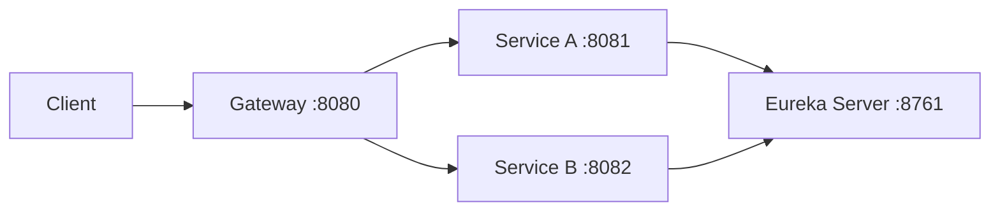

## 📌 Spring Cloud Discovery – Exemplo Simples

[](https://skillicons.dev)

Este projeto demonstra o funcionamento do Service Discovery utilizando Spring Cloud Netflix Eureka e Spring Cloud Gateway com quatro aplicações:

- *eureka-server* → Servidor de descoberta
- *servicea* → Serviço cliente
- *serviceb* → Serviço cliente
- *gateway* → Ponto único de acesso aos serviços (roteamento)


## 🏗 Arquitetura



Visão em texto:

```
    +-------------------+
    |   Eureka Server   |
    |     (8761)        |
    +-------------------+
       ↑             ↑
       |             |
 +-----------+  +-----------+
 | Service A |  | Service B |
 |  (8081)   |  |  (8082)   |
 +-----------+  +-----------+
       ↑             ↑
       |             |
    +-------------------+
    |     Gateway       |
    |     (8080)        |
    +-------------------+
             ↑
          Cliente
```


## 🔎 Como funciona

### 1. Eureka Server (eureka-server)

É o servidor de registro de serviços: mantém o catálogo de serviços ativos e permite que outros componentes descubram instâncias pelo nome. Como é o servidor, não se registra em si mesmo (`register-with-eureka: false`, `fetch-registry: false`).

**Configuração principal:**

```yaml
spring:
  application:
    name: eureka-server
server:
  port: 8761
eureka:
  client:
    register-with-eureka: false
    fetch-registry: false
```

- Mantém um registro de todos os serviços ativos
- Permite que serviços encontrem outros serviços pelo nome

**Painel:** http://localhost:8761/


### 2. Service A (servicea)

```yaml
spring:
  application:
    name: servicea
server:
  port: 8081
eureka:
  client:
    service-url:
      defaultZone: http://localhost:8761/eureka/
```

- Sobe na porta 8081
- Se registra automaticamente no Eureka
- Endpoint de exemplo: `GET /service-a/helloWorld`


### 3. Service B (serviceb)

```yaml
spring:
  application:
    name: serviceb
server:
  port: 8082
eureka:
  client:
    service-url:
      defaultZone: http://localhost:8761/eureka/
```

- Sobe na porta 8082
- Se registra automaticamente no Eureka
- Endpoint de exemplo: `GET /service-b/helloWorld`


### 4. Gateway (gateway)

Spring Cloud Gateway Server WebMVC como ponto único de entrada. Encaminha o tráfego para os serviços conforme o path.

**Configuração principal (rotas):**

```yaml
spring:
  application:
    name: gateway
  cloud:
    gateway:
      server:
        webmvc:
          routes:
            - id: service-a
              uri: http://localhost:8081
              predicates:
                - Path=/service-a/**
            - id: service-b
              uri: http://localhost:8082
              predicates:
                - Path=/service-b/**
server:
  port: 8080
```

- Sobe na porta 8080
- `/service-a/**` → encaminha para Service A (8081)
- `/service-b/**` → encaminha para Service B (8082)

**Acesso via Gateway:**

- http://localhost:8080/service-a/helloWorld → resposta do Service A
- http://localhost:8080/service-b/helloWorld → resposta do Service B


### 🔁 Fluxo de funcionamento

1. O Eureka Server sobe primeiro (8761).
2. Service A e Service B iniciam e se registram no Eureka.
3. O Gateway sobe (8080) e encaminha pedidos conforme as rotas configuradas.

O Eureka mantém o mapeamento:

- `servicea` → localhost:8081
- `serviceb` → localhost:8082

Os clientes podem acessar os serviços diretamente pelas portas ou através do Gateway em um único host/porta (8080).


### 🚀 Ordem de execução

1. Subir **eureka-server**
2. Subir **servicea**
3. Subir **serviceb**
4. Subir **gateway**

Em cada módulo (a partir da raiz do repo):

```bash
cd eureka-server && mvn spring-boot:run
cd servicea      && mvn spring-boot:run
cd serviceb      && mvn spring-boot:run
cd gateway       && mvn spring-boot:run
```

**URLs úteis:**

- Painel Eureka: http://localhost:8761/
- Service A via Gateway: http://localhost:8080/service-a/helloWorld
- Service B via Gateway: http://localhost:8080/service-b/helloWorld


### 🎯 Benefícios do Service Discovery

- Não é necessário fixar IP/porta nos clientes
- Facilita escalabilidade e múltiplas instâncias do mesmo serviço
- Base para load balancing e arquitetura de microserviços
- Gateway oferece um único ponto de entrada e roteamento centralizado


---

| Aplicação     | Função                           | Porta |
| ------------- | -------------------------------- | ----- |
| eureka-server | Registro de serviços             | 8761  |
| servicea      | Serviço cliente registrado       | 8081  |
| serviceb      | Serviço cliente registrado       | 8082  |
| gateway       | Roteamento e ponto único de acesso | 8080  |
